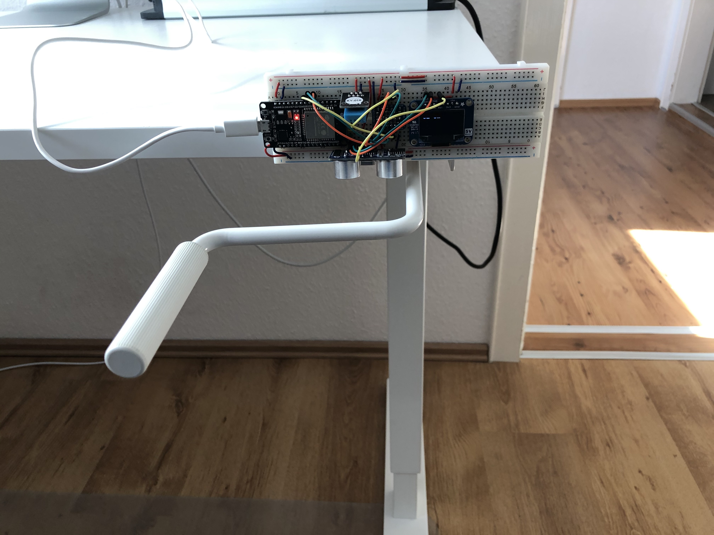

# LsCompanionFirmware: Firmware for an ESP to Get the Height of Sit/Stand Tables

Authors: Simon Bogutzky

License: [MIT](https://opensource.org/licenses/MIT)

Version: 1.0.0

Document version: 1.0.2 

Date: 31/05/2020

## What is the LsCompanionFirmware?

The LS Companion firmware is developed for a ESP32 microcontroller e.g. [Waveshare NodeMCU-32S ESP32 Development Board](https://www.amazon.com/dp/B07TXNK6P1/ref=cm_sw_em_r_mt_dp_U_DbcMEbPJSWKTA). It uses an ultrasonic wave sensor [HC-SR04](https://www.sparkfun.com/products/15569) and determines the height of a height-adjustable table. It transmits the table height via BLE to a connected client.

*LS Companion Prototype*

## Author and Contribution
As expressed by license, this is free software published by Simon Bogutzky. The author (Simon Bogutzky) welcomes external contributors to freely use and extend this software. If you need help, please write an [issue](https://github.com/sbogutzky/LsCompanionFirmware/issues).
